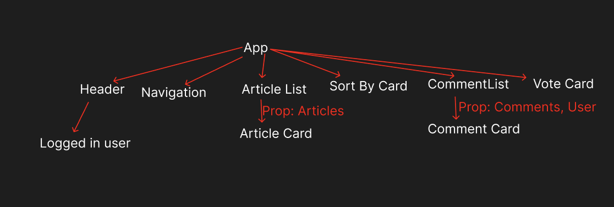

# NorthCoders News React App

The front-end for a full stack news website built on my [RESTful API](https://github.com/tr-tobi/nc-news). User is able to view articles, filtering the articles by topic and the user can sort the articles by title, author and date posted. This can then be displayed in ascending or descending order.

A user is also able to select a username and post a comment to a specific article and they are only able to delete their comments.

Initial wireframe for this project can be seen [below](#application-wireframe-and-tree).

## Link to hosted Website

https://trtobi-news.netlify.app/

## Link to RESTful API

https://github.com/tr-tobi/nc-news

## Installation

1. [Node.js](https://nodejs.org/en) is installed:

2. Fork this repo and clone it using:

```
git clone https://github.com/tr-tobi/fe-nc-news.git
```

3. cd to the root file of the repo and install the dependencies using:

```
npm install
```

The minimum version of Node.js is:

```
v20.3.1
```

## Application Wireframe and Tree:



